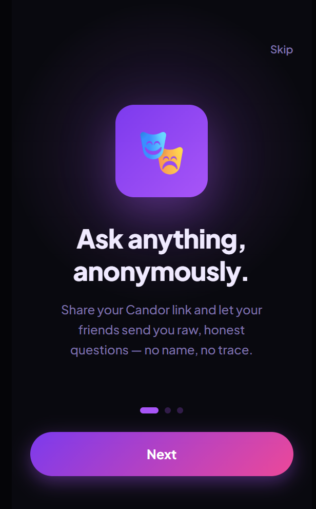
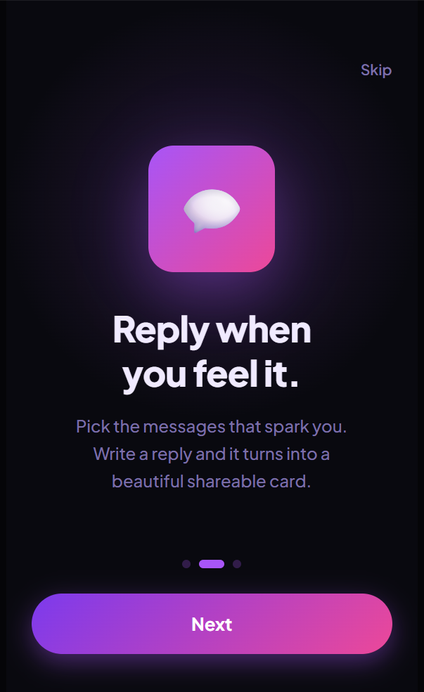
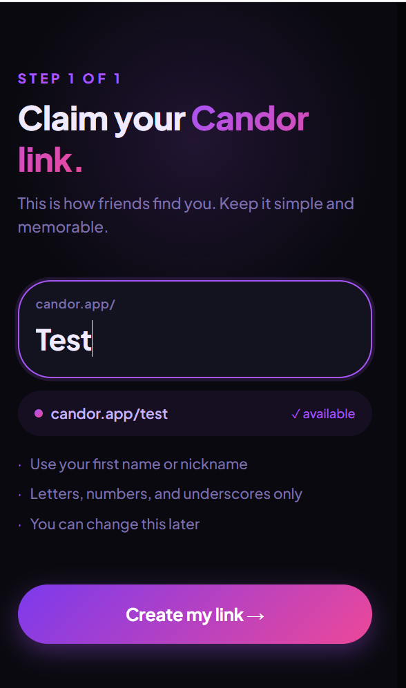
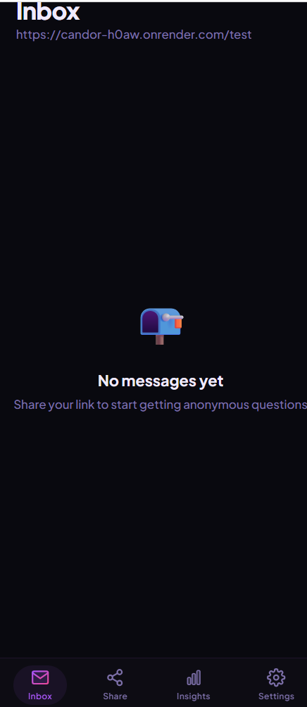
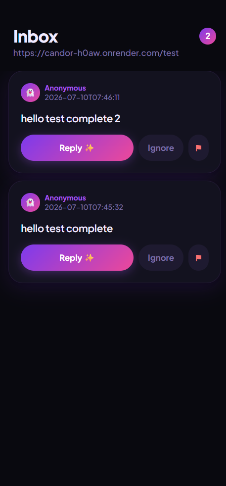
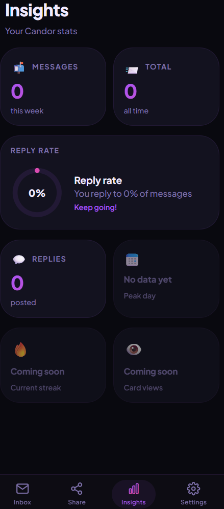
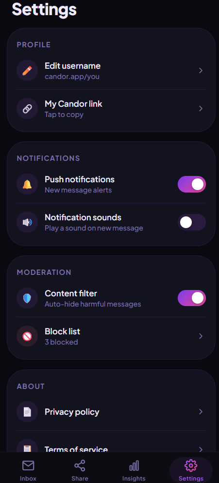
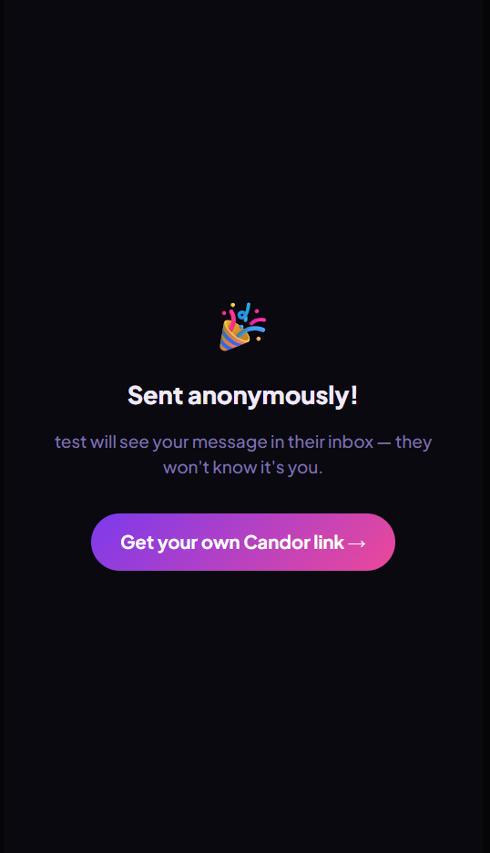

# Candor — Anonymous Q&A Platform

> A full-stack anonymous Q&A platform that enables users to receive honest feedback through shareable public links while maintaining secure owner-only access to their inbox and replies.


---

## 🌐 Live Demo

**Application:**  
https://candor-h0aw.onrender.com/

> **Note:** The application is hosted on Render's free tier. If it has been idle for some time, the first request may take approximately 30–50 seconds while the server wakes up.

---

## 📦 Repository

https://github.com/AshutoshMohanty07/Candor

---

# Overview

Candor is a modern anonymous messaging platform inspired by social feedback applications.

Users create a personal public link and receive anonymous messages from friends, colleagues, or followers. Only the account owner can access incoming messages, reply to selected conversations, and view engagement analytics.

The project was designed to demonstrate full-stack engineering, product thinking, backend architecture, secure API design, and deployment of a production-ready web application.

---

# The Problem

Collecting honest feedback is difficult because people often hesitate to share opinions openly.

Candor reduces that friction by allowing anyone to send anonymous messages while ensuring that only the intended recipient can access their inbox.

---

# Solution

Candor provides:

- Anonymous messaging
- Shareable public profile links
- Private owner-only inbox
- Reply workflow
- Insights dashboard
- Rate limiting against spam
- Secure token-based authentication
- Responsive mobile-first interface

---

# Key Features

## Anonymous Messaging

- Public shareable profile
- No sender account required
- Anonymous submissions

---

## Secure Inbox

Only the owner can:

- Read messages
- Reply
- Delete messages
- View analytics

---

## Insights Dashboard

Track:

- Messages received
- Replies posted
- Reply rate
- Weekly activity

---

## Share Screen

Quick sharing to:

- WhatsApp
- Instagram
- X (Twitter)

---

## Security

Implemented security measures include:

- Private owner tokens
- Username never used for authorization
- Flask rate limiting
- Protected API routes
- Environment variable configuration
- SQL foreign key constraints

---

# Screenshots

## Onboarding






---

## Username Setup



---

## Inbox



---

## Message Received



---

## Insights



---

## Settings



---

## Message Sent



---

# System Architecture

```
                    Anonymous Visitor
                            │
                            ▼
                 React + TypeScript (Vite)
                            │
                 REST API Requests
                            │
                            ▼
                    Flask REST Backend
                            │
                Authentication Layer
                            │
                Owner Token Validation
                            │
                            ▼
                  MySQL Database (Aiven)
                            │
                Users
                Messages
                Replies
```

---

# Database Design

The application uses a normalized relational schema consisting of three tables.

### Users

Stores:

- Username
- Owner Token

---

### Messages

Stores:

- Anonymous message
- Timestamp
- Associated user

---

### Replies

Stores:

- Reply content
- Associated message
- Creation timestamp

Foreign keys maintain referential integrity across the database.

---

# Tech Stack

## Frontend

- React 19
- TypeScript
- Vite
- Tailwind CSS
- React Router

---

## Backend

- Python
- Flask
- Flask-CORS
- Flask-Limiter
- Gunicorn

---

## Database

- MySQL
- Aiven Cloud Database

---

## Deployment

- Docker
- Render
- GitHub

---

## Development

- Git
- Replit
- Figma

---

# Security Decisions

Instead of authorizing users using public usernames, Candor generates a cryptographically secure owner token during account creation.

Only requests containing the correct owner token can:

- View inbox
- Reply
- Delete messages
- Access analytics

This prevents unauthorized users from accessing another user's data simply by guessing a username.

Public endpoints are additionally protected using request rate limiting to reduce spam.

---

# Product Decisions

Several product decisions were intentionally made during development:

- Mobile-first responsive interface
- Minimal onboarding flow
- Anonymous-by-default experience
- Lightweight backend architecture
- Separate owner authentication from public identity
- Cloud-hosted relational database
- Production deployment using Docker

---

# Challenges

During development several engineering challenges were solved, including:

- Designing secure anonymous messaging
- Building token-based authorization
- Deploying React and Flask together
- Configuring MySQL on Aiven Cloud
- Dockerizing frontend and backend
- Managing production environment variables
- Integrating Render deployment

---

# Future Improvements

Potential future enhancements include:

- Push notifications
- Email notifications
- AI-based content moderation
- User blocking
- Message reactions
- Public profile customization
- Image attachments
- Analytics improvements
- Automated testing

---

# Local Development

Clone the repository

```bash
git clone https://github.com/AshutoshMohanty07/Candor.git
```

Install dependencies

```bash
cd backend
pip install -r requirements.txt
```

Start backend

```bash
python app.py
```

Run frontend

```bash
pnpm install
pnpm dev
```

---

# Deployment

The application is deployed using:

- Docker
- Render
- MySQL (Aiven)

Environment variables are managed securely using Render Secrets.

---

# Lessons Learned

This project strengthened practical experience in:

- REST API design
- Authentication strategies
- SQL schema design
- Docker deployment
- Cloud databases
- Production debugging
- Full-stack application architecture
- Product thinking and feature prioritization

---

# License

This project is licensed under the MIT License.
